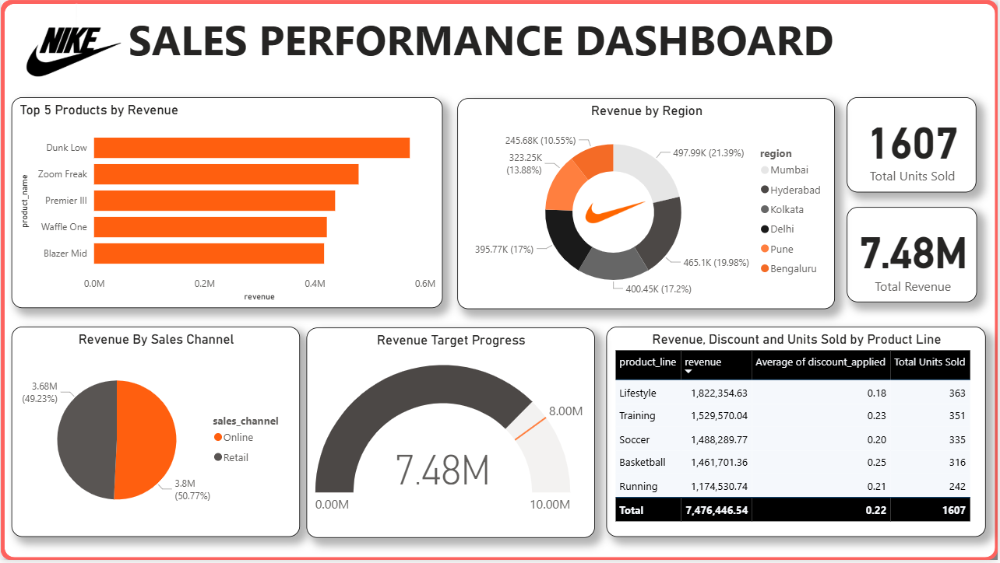

# Nike Sales Performance Analysis — EDA & Power BI Dashboard

**Capstone project for the EDA Mastery: From Data to Insights certificate course**
Skill Studio, Department of Computer Science · Kristu Jayanti University | Python · Power BI · Statistical Analysis

---

## Problem Statement

> How can Nike optimize its discount strategy and product focus to maximize revenue across different regions, categories, and sales channels in the Indian market?

---

## Project Overview

This project applies a full end-to-end Exploratory Data Analysis pipeline to a Nike India sales dataset covering 796 transactions across 6 cities, 5 product lines, 3 gender categories, and 2 sales channels. The objective was not just to describe the data — but to surface actionable recommendations around discounting, product prioritization, and regional focus.

---

## Dataset

| Field | Detail |
|---|---|
| Records | 796 transactions |
| Columns | 13 |
| Period | 2024 (full year) |
| Regions | Hyderabad, Bengaluru, Mumbai, Delhi, Kolkata, Pune |
| Product Lines | Lifestyle, Running, Basketball, Soccer, Training |
| Sales Channels | Retail, Online |
| Gender Categories | Men, Women, Kids |

**Key columns:** `order_id`, `product_line`, `product_name`, `gender_category`, `units_sold`, `mrp`, `discount_applied`, `revenue`, `profit`, `sales_channel`, `region`, `order_date`, `size`

---

## Tools & Libraries

- **Python** — Pandas, NumPy, Matplotlib, Seaborn, Plotly, SciPy
- **Power BI** — Interactive dashboard for stakeholder presentation
- **Jupyter Notebook** — Full analysis pipeline

---

## Workflow

### 1. Data Cleaning & Preparation
- Standardized column names (stripped whitespace, lowercased)
- Resolved inconsistent region labels (`Hyd` → `Hyderabad`, `bengaluru` / `Bangalore` → `Bengaluru`)
- Encoded categorical size values (`M` → 7, `L` → 9, `XL` → 11)
- Handled missing values using context-appropriate strategies:
  - MRP → filled with column mean
  - Units Sold → filled with mode
  - Discount Applied → filled with 0 (no discount assumed)
- Filtered out negative unit sales records
- Clipped discount values to valid range [0, 1]
- Engineered three derived columns: `discounted_amount`, `discounted_price`, `revenue`
- Parsed `order_date` to datetime and extracted year and month features

### 2. Exploratory Analysis
- Product popularity and demand distribution (countplot, horizontal bar)
- Shoe size spread (boxplot)
- Revenue contribution by gender category (pie chart)
- Correlation analysis across MRP, units sold, discount rate, revenue, and profit (heatmap)

### 3. Time-Series Analysis
- Extracted month and year from order dates
- Plotted monthly revenue trends over the full year using a line chart

### 4. Interactive Visualization
- Built an interactive scatter plot (Units Sold vs Revenue) with an OLS trendline using Plotly Express

### 5. Hypothesis Testing
- Conducted an **independent samples t-test** comparing revenue between the Lifestyle and Running product lines
- Result: statistically significant — the performance gap is not attributable to chance

---

## Key Findings

### Discount does not drive revenue
The Lifestyle category had the **lowest average discount** across all product lines, yet ranked **first in both revenue and units sold**. Heavy discounting in other categories did not produce equivalent returns — suggesting that brand pull, not price reduction, is the dominant revenue driver for Lifestyle products.

### Basketball is underperforming relative to its discount load
Basketball carried the **highest discount rate** across product lines but ranked **fourth in categorical revenue performance**. This indicates a structural issue — discounting is not compensating for weaker demand or positioning, it is simply eroding margin without converting volume.

### The Lifestyle vs Running gap is statistically significant
The t-test result confirms that the revenue difference between Lifestyle and Running is not random. Both categories deserve focused investigation — Lifestyle to understand what is driving its dominance, Running to understand why it is underperforming relative to expectations.

### Regional performance is uneven and actionable
- **Hyderabad and Kolkata** — strong-performing markets with high revenue conversion
- **Bengaluru and Pune** — meaningful market presence but proportionate revenue has not yet followed; untapped potential exists

---


## Recommendations

1. **Test a controlled discount reduction in Lifestyle** — assess whether demand holds without the discount dependency. If it does, margin improves without touching volume.
2. **Investigate Basketball and Running** — determine whether the underperformance is a pricing problem, product-market fit issue, or distribution gap before committing further discount spend.
3. **Prioritize Hyderabad and Kolkata** for high-return investment while deploying targeted campaigns in Bengaluru and Pune to convert latent demand into revenue.

---

## Repository Structure

```
Nike-Sales-Analysis/
│
├── Nike_Sales_Analysis.ipynb        # Full EDA pipeline — cleaning, analysis, visualizations, hypothesis testing
├── Nike_Sales_Cleaned.csv           # Cleaned and feature-engineered dataset (output of notebook)
├── Nike_Sales_Performance_Dashboard.pbix   # Power BI dashboard file
├── Nike_Sales_Dashboard.pdf         # Exported PDF of the dashboard (viewable without Power BI)
└── README.md
```

---

## How to Run

1. Clone the repository
   ```bash
   git clone https://github.com/your-username/Nike-Sales-EDA.git
   ```
2. Install dependencies
   ```bash
   pip install pandas numpy matplotlib seaborn plotly scipy
   ```
3. Open the notebook
   ```bash
   jupyter notebook Nike_Sales_Analysis.ipynb
   ```

> The Power BI dashboard (`.pbix`) requires Power BI Desktop to open. A PDF export is included for quick viewing.

---

## Certificate

This project was completed as the capstone for the **EDA Mastery: From Data to Insights** certificate course, organised by Skill Studio, Department of Computer Science, Kristu Jayanti University.

---

*Analysis by Aryan Sumaraj*
